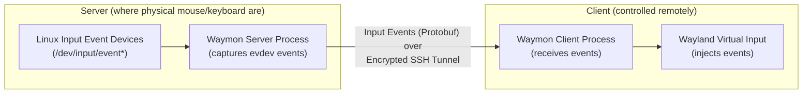

# Waymon

**Wayland Mouse Over Network** - A seamless input sharing solution for Wayland that allows you to control multiple computers with a single mouse and keyboard, similar to Synergy/Barrier but built specifically for modern Wayland compositors.

> ⚠️ **Early Development Stage**: This project is in active development. While the core functionality is working, expect breaking changes and rough edges. Contributions and feedback are welcome!

## Features

### Working
- ✅ **Mouse button events** (left, right, middle click)
- ✅ **Keyboard input** forwarding
- ✅ **Secure SSH transport** with key-based authentication
- ✅ **Real-time TUI** for monitoring connections and status
- ✅ **Automatic input release** on client disconnect
- ✅ **Emergency release** mechanisms (Ctrl+ESC, timeout, manual)

### Todo
- 🚧 Screen edge detection and switching
- 🚧 Absolute mouse positioning
- 🚧 Cursor constraints
- 🚧 Improved display boundary detection
- 🚧 Edges detection and switching
- 🚧 Multiple monitor support on client
- 🚧 Multiple simultaneous client support
- 🚧 Clipboard synchronization (TBD)

## How It Works

Waymon captures input events on the server (the one with the physical keyboard and mouse) using Linux's evdev interface, forwards them over an encrypted SSH connection to the client, and injects them using Wayland's virtual input protocols. When you move your mouse to the edge of your screen, control seamlessly switches between computers.

## Requirements

### Server (Computer being controlled)
- Linux with Wayland compositor
- Root/sudo access (for evdev input capture)
- SSH server
- Port 52525 available (configurable)

### Client (Computer you're controlling from)
- Linux with Wayland compositor supporting:
  - `zwp_virtual_pointer_v1` protocol
  - `zwp_virtual_keyboard_v1` protocol
- SSH client with key-based authentication

### Tested Compositors
- ✅ Hyprland
- ⚠️ GNOME Wayland (needs testing)
- ⚠️ KDE Wayland (needs testing)

## Installation

### From Source (Recommended during alpha)

```bash
git clone https://github.com/bnema/waymon.git
cd waymon
go build -o waymon .
sudo mv waymon /usr/local/bin/
```

### The Go Install way
```bash
go install github.com/bnema/waymon@latest
```

## Quick Start

1. **On the server** (computer to be controlled):
   ```bash
   sudo waymon server
   ```

2. **On the client** (computer you're controlling from):
   ```bash
   waymon client --host SERVER_IP:52525
   ```

3. **First connection**: You'll be prompted on the server to approve the client's SSH key

4. **Start using**: Move your mouse to the edge of the screen to switch control!

## Server Controls

When running the server, you can use these keyboard shortcuts in the TUI:

- **0** or **ESC**: Return control to local (server) system
- **1-5**: Switch control to connected client by number
- **R**: Manual emergency release (when controlling a client)
- **Tab**: Cycle through connected clients
- **G/g**: Navigate logs (bottom/top)
- **Q**: Quit server

## Emergency Release

If input gets stuck while controlling a client, Waymon provides multiple release mechanisms:

1. **Ctrl+ESC**: Emergency key combination (when grabbed)
2. **R key**: Manual release in server TUI
3. **30-second timeout**: Automatic release after inactivity
4. **Client disconnect**: Automatic release when client disconnects
5. **SIGUSR1**: Send signal to server process: `sudo pkill -USR1 waymon`
6. **Touch file**: Create `/tmp/waymon-release` to trigger release

## Configuration

Waymon uses TOML configuration files. Create `~/.config/waymon/waymon.toml`:

```toml
[server]
port = 52525
bind_address = "0.0.0.0"
name = "my-desktop"
max_clients = 1
ssh_whitelist_only = true

[client]
server_address = "192.168.1.100:52525"
auto_connect = false
reconnect_delay = 5
edge_threshold = 5
# Hotkey switching disabled by default during alpha
# hotkey_key = "s"
# hotkey_modifier = "ctrl+alt"

[logging]
file_logging = true         # Enable/disable file logging (default: true)
log_level = "INFO"          # Set to "DEBUG" for troubleshooting
```

## Troubleshooting

### Debug Logging

Enable debug logs by either:

1. Setting the environment variable:
```bash
sudo LOG_LEVEL=DEBUG waymon server
```

2. Or in the config file:
```toml
[logging]
log_level = "DEBUG"
```

Log files are stored in:
- Server: `/var/log/waymon/waymon.log` (when run with sudo)
- Client: `~/.local/share/waymon/waymon.log`

To disable file logging (logs only in TUI):
```toml
[logging]
file_logging = false
```

### Common Issues

**"Failed to grab device: device or resource busy"**
- Another application may be using exclusive input access
- Try closing other input management tools

**"Emergency release triggered"**
- This is a safety feature - input was inactive for 30 seconds
- Increase timeout in code if needed (will be configurable soon)

**Mouse clicks not working**
- Fixed in latest version - update if you're on an older build
- Check debug logs for button mapping issues

**Keyboard input showing wrong characters**
- Keymap synchronization is not yet implemented
- Both systems should use the same keyboard layout

## Architecture



## Contributing

Contributions are welcome! Areas where help is needed:

- Testing on different Wayland compositors
- Security review
- Documentation improvements
- Bug reports and fixes
- Multiple monitor support
- TUI polish

## Related Projects

- [Synergy](https://symless.com/synergy) - Commercial cross-platform solution
- [Barrier](https://github.com/debauchee/barrier) - Open-source fork of Synergy
- [Input-leap](https://github.com/input-leap/input-leap) - Barrier fork with Wayland support
- [waynergy](https://github.com/r-c-f/waynergy) - Synergy client for Wayland
- [lan-mouse](https://github.com/feschber/lan-mouse) - Rust-based input sharing

## License

MIT License - see LICENSE file for details

## Acknowledgments

- Built with [Bubble Tea](https://github.com/charmbracelet/bubbletea) for the TUI
- Uses [Wish](https://github.com/charmbracelet/wish) for SSH server
- Protocol Buffers for efficient serialization
- The Wayland community for protocol documentation